# Solar OT Lab

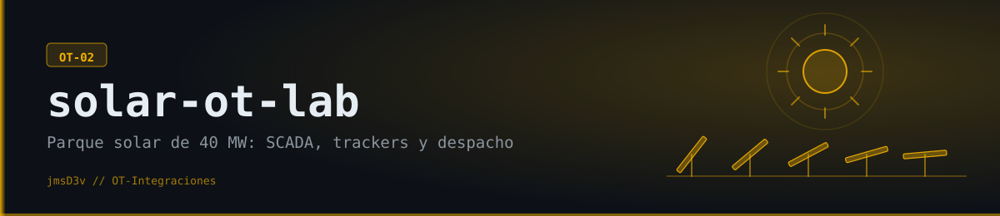

**Mini-SCADA de laboratorio** para un parque solar utility-scale (**Cauchari, Jujuy — 40 MW**): agentes de campo que leen los equipos en tiempo real, un gateway FastAPI que los recibe y un dashboard tipo centro de comando con drill-down planta → bloque → inversor. Los equipos son simulados (150 inversores y 450 trackers en 6 bloques, estación transformadora 132/34,5 kV, controlador de planta y una estación meteorológica con días despejados, nublados y de lluvia), pero **los protocolos son reales**: Modbus TCP dentro del parque e IEC 60870-5-104 hacia el despacho. Segundo proyecto de la serie **OT-Integraciones** de [@jmsD3v](https://github.com/jmsD3v).

  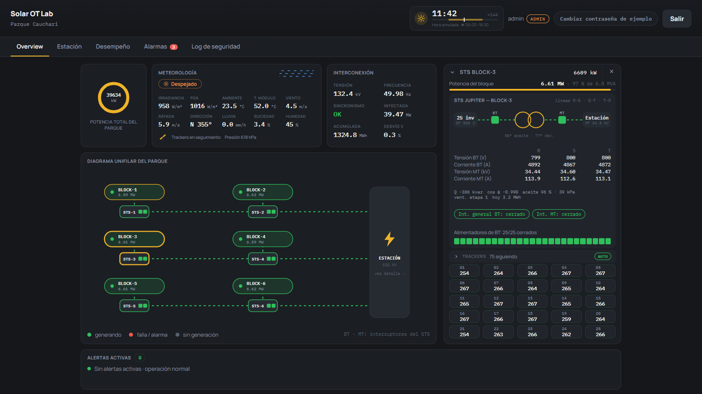

---

## Qué hace

Un parque solar real no es un inversor: son decenas por bloque (acá, 25 × 6 = 150), cada uno alimentado por 3 trackers; un STS (transformador + protección) por bloque; una estación transformadora que sube a 132 kV; un controlador de planta; un enlace con el despacho de la red; y una estación meteorológica que decide cuándo poner los trackers en posición de defensa. Este laboratorio simula **toda esa jerarquía** y la integra de punta a punta:

- **Monitoreo** con drill-down real (planta → bloque → inversor) y alarmas con ciclo de vida ISA-18.2.
- **Control remoto** con Modbus TCP (mapa inspirado en SunSpec): comandos por inversor y **consignas de planta** (límite de MW, reactiva o factor de potencia, rampa) que el PPC reparte y corrige contra el medidor de frontera.
- **Trackers de verdad:** el inversor solo convierte corriente continua en alterna; lo que sigue al sol es el tracker, con su propio controlador (TCU: motor, panel y batería) y una unidad de red (NCU) por bloque que los comanda por radio.
- **Un cielo que cambia:** días despejados, parcialmente nublados, cubiertos y de lluvia, con nubes que cruzan el parque de un bloque al siguiente.
- **Secuencia de eventos (SOE)** con la hora del *equipo* en milisegundos: estación, STS de cada bloque y NCU de trackers.
- **IEC 60870-5-104** hacia el despacho, real (tramas I/S/U, interrogación general, envío espontáneo).

Ver [docs/adr/0004](docs/adr/0004-fleet-hierarchy-and-shared-environment-clock.md) para la jerarquía, [0007](docs/adr/0007-trackers-tcu-ncu.md) para los trackers y [0008](docs/adr/0008-weather-fault-rate-inverter-scope-soe-iec104.md) para el clima, el SOE y el enlace IEC 104.

## Qué es (y qué no es)

Es un **mini-SCADA de laboratorio**: hace lo que hace un SCADA — adquisición, pantallas, alarmas, historial, control y registro de eventos — para una sola planta, con equipos simulados. **No es** un SCADA comercial: no se probó con inversores reales, tiene una sola instancia (sin alta disponibilidad) y no cuenta con certificaciones como IEC 62443 o SunSpec.

| Función de un SCADA | Cómo está resuelta acá |
|---|---|
| Adquisición de datos | Agentes de campo que leen por Modbus TCP (multi-equipo por unit ID) e IEC 60870-5-104; reporte por excepción con bandas muertas y buffer offline (SQLite) |
| Pantallas (HMI) | Dashboard React con diagramas en SVG: unifilar de la planta y de la estación, drill-down hasta cada inversor, actualización en vivo por WebSocket |
| Alarmas | Ciclo de vida ISA-18.2 (activa, reconocida, normalizada), calidad del dato, equipos mudos y supresión de alarmas en cascada |
| Historial | Lecturas crudas de corta vida, agregados por minuto y KPI de planta (PR, factor de capacidad, disponibilidad) |
| Control | Comandos por inversor, modo de los trackers y consignas de planta (MW, reactiva, factor de potencia, rampa) con un controlador en lazo cerrado |
| Secuencia de eventos (SOE) | Eventos con la hora del *equipo* en milisegundos: estación, STS de cada bloque y NCU de trackers |
| Seguridad | Redes segmentadas (OT / DMZ / IT), permisos por rol, token propio por agente, MQTT con usuario, ACL y TLS, auditoría de eventos de seguridad |

**Qué demuestra:** el recorrido completo de un sistema industrial en tiempo real — equipo → agente de campo → gateway → base de datos → dashboard por WebSocket —, con decisiones de diseño documentadas (8 ADRs), 390 tests, integración continua e imágenes multi-arquitectura.

## Cómo se ve

Vista de escritorio del dashboard real corriendo contra el stack completo (también es responsivo hasta 320 px).

**Planta.** El parque completo con un bloque abierto: potencia por inversor, el STS y su NCU. El estado del cielo (☀ Despejado, ⛅ Parcialmente nublado, ☁ Cubierto, 🌧 Lluvia) se lee en la card de meteorología, arriba de las cifras. Al desplegar "Trackers" flotan los 75 trackers del bloque (de a 3 por inversor) con su ángulo real; el administrador puede mandarlos a defensa o a plano.

  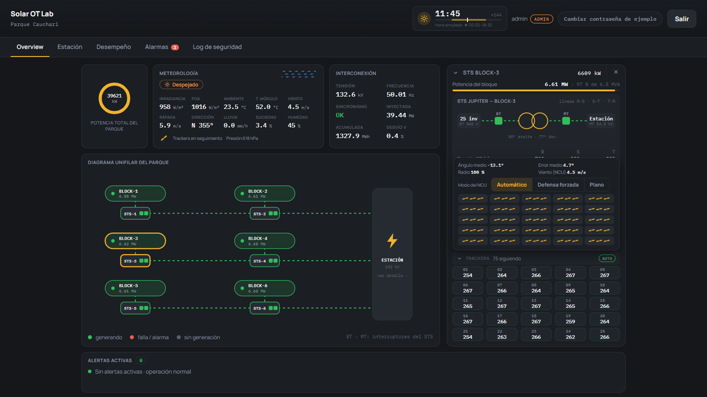

**Un inversor informa solo lo suyo.** Potencia, corriente y tensión DC, temperatura interna, fases, 9 entradas MPPT y aislamiento; y los 3 trackers que lo alimentan, cada uno con su motor y su batería.

  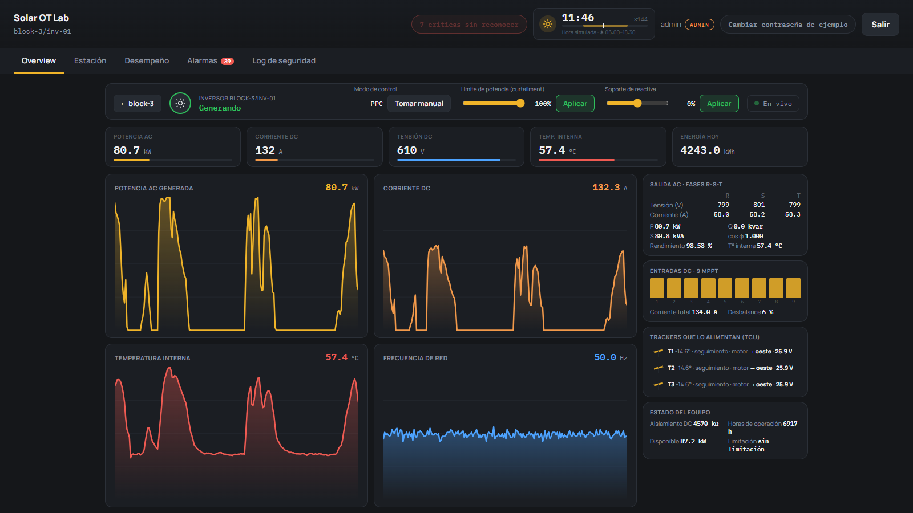

**Estación transformadora y despacho.** Unifilar 132/34,5 kV con protecciones, transformador principal, MT con 3 colectores y el PPC en lazo cerrado; y el panel del despacho de la red, que lee la planta por IEC 104.

  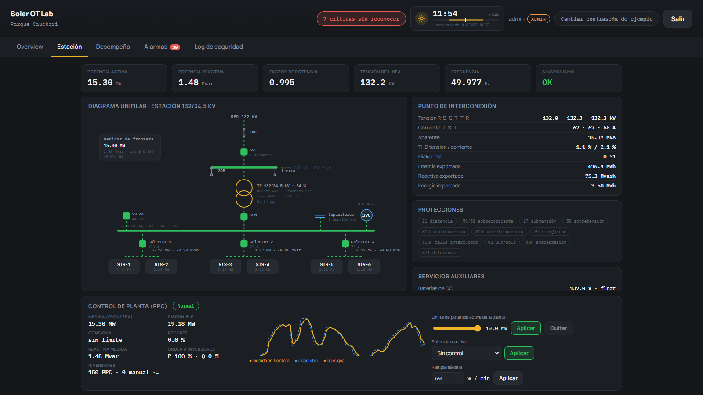
  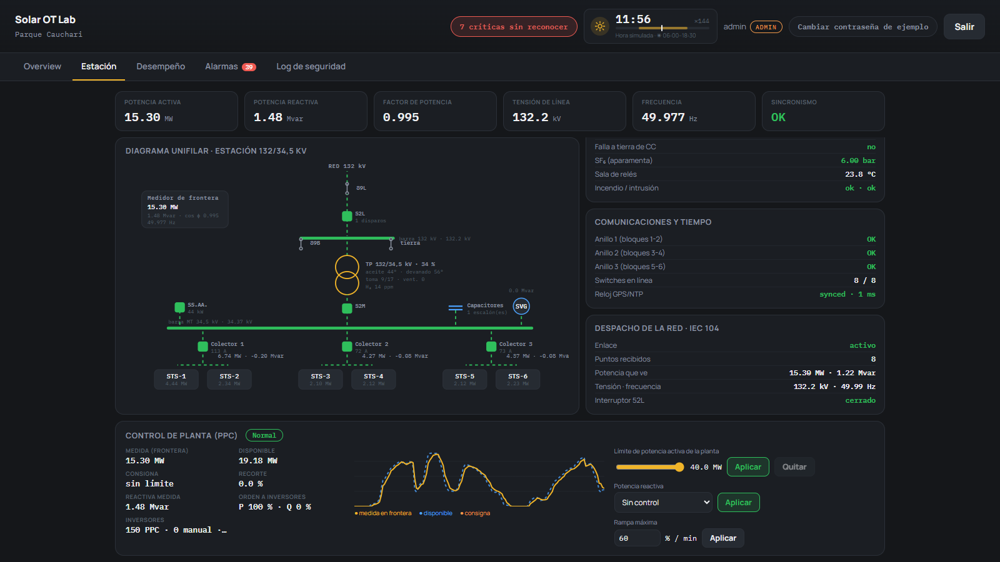

**Desempeño, alarmas y secuencia de eventos.** PR, factor de capacidad y disponibilidad; alarmas ISA-18.2; y el SOE con filtro por origen (estación, bloques, trackers).

  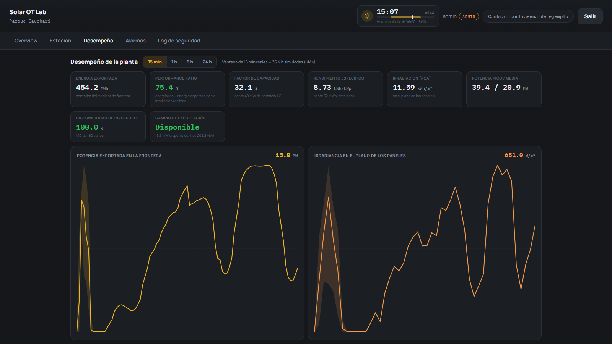
  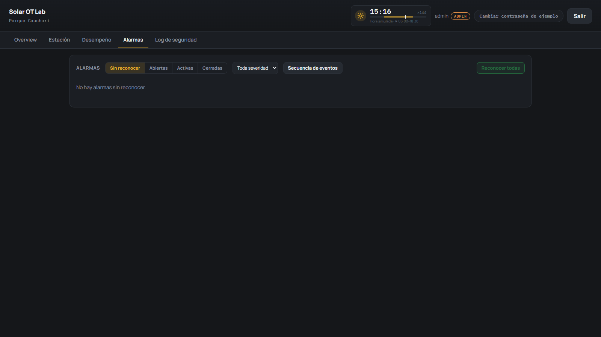

  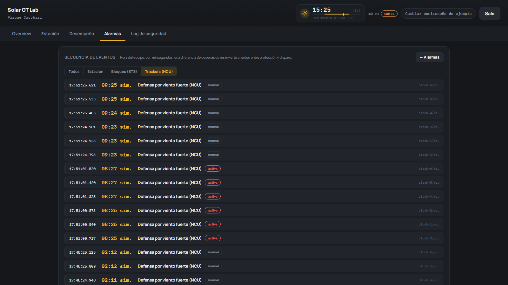
  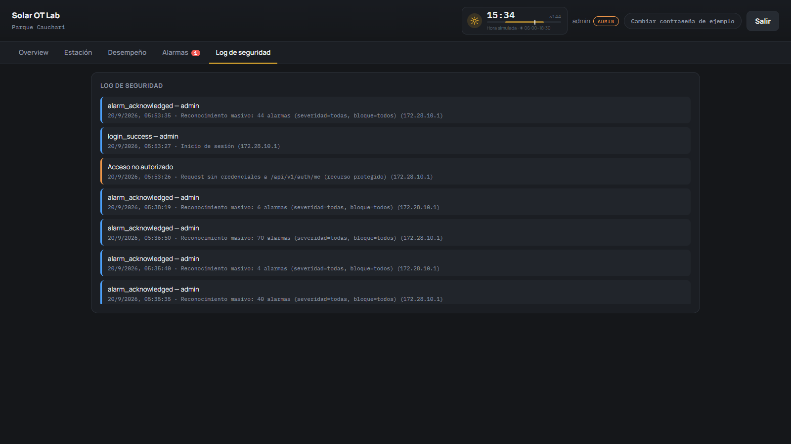

## En movimiento

Un recorrido de 40 segundos por el dashboard: planta, trackers, inversor, estación y despacho, desempeño, alarmas y secuencia de eventos.

  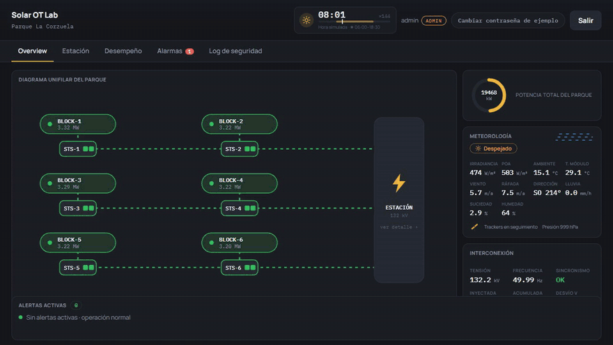

[Ver en mejor calidad (MP4)](docs/demo.mp4)

## Características

- **Flota jerárquica real** — 6 bloques × (25 inversores + STS + NCU con 75 trackers), estación central y PPC como procesos separados, cada uno con su mapa Modbus.
- **Reloj de entorno compartido** — el sol, el viento y el cielo son función del reloj de pared: todos los procesos coinciden sin mandarse mensajes. Un "día" dura 10 minutos (×144), con noche real.
- **Estación acoplada a los bloques** — mide lo que entregan los STS y les da o quita el camino de evacuación (línea de 132 kV, transformador principal, colectores).
- **Simulación ajustable** — `SIM_FAULT_RATE` (ritmo de las fallas aleatorias: `1` demo, `0.3` tranquilo, `0` todo perfecto) y `SIM_SKY` (`auto`, `clear`, `partly`, `overcast`, `rainy`).
- **Contexto de planta** — un amanecer, una tormenta o un frente de nubes cambian los 150 equipos a la vez; se explican una sola vez en lugar de generar 150 alarmas.
- **Calidad del dato y comunicación** — rango físico validado en el agente, `quality`/`bad_tags`, monitor de equipos mudos.
- **Historian liviano** — lecturas crudas de corta vida, agregados por minuto, KPI de planta calculados desde los agregados.
- **Seguridad por diseño** — tres redes segmentadas (OT / DMZ / IT), contenedores con `cap_drop` y sistema de archivos de solo lectura, token propio por agente, Mosquitto con usuario y ACL por agente, sesión en cookie `HttpOnly`, RBAC (admin / operador), modo demostración de solo lectura.

## Arquitectura

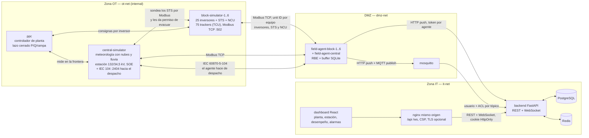

7 procesos de simulación en la zona OT (6 bloques + central), el PPC y 7 field-agents en la DMZ. Segmentación de red real, no solo documentada: ver [docs/adr/0002](docs/adr/0002-network-segmentation-and-container-hardening.md).

## Stack

| Capa | Tecnología |
|---|---|
| Field agent | Python 3.14, `pymodbus` 3.15 (multi-unit-ID por bloque + agente con roster), IEC 60870-5-104 propio y sin dependencias, SQLite (buffer offline por equipo), `paho-mqtt` |
| Backend / Gateway | Python 3.14, FastAPI, SQLAlchemy 2.0, PostgreSQL 18, Redis 8, WebSocket, PyJWT en cookie `HttpOnly`, `bcrypt` |
| Dashboard | React 19 + TypeScript 7, Vite 8; diagramas HMI en SVG; servido por nginx con proxy de mismo origen |
| Infra | Docker Compose (20 servicios), tres redes segmentadas, Mosquitto con usuario y ACL por agente, TLS, imágenes multi-arquitectura (amd64 + arm64) |

## Decisiones técnicas (ADRs)

| ADR | Decisión |
|---|---|
| [0001](docs/adr/0001-sunspec-inspired-modbus-register-map.md) | Mapa de registros inspirado en SunSpec |
| [0002](docs/adr/0002-network-segmentation-and-container-hardening.md) | Segmentación de red y hardening de contenedores |
| [0003](docs/adr/0003-alarm-rules-and-curtailment-rbac.md) | Reglas de alarma sin umbrales fijos día/noche, curtailment con RBAC |
| [0004](docs/adr/0004-fleet-hierarchy-and-shared-environment-clock.md) | Flota jerárquica (150 inversores, STS, central) y reloj de entorno compartido |
| [0005](docs/adr/0005-scada-completion-station-ppc-alarms.md) | SCADA completo: alarmas ISA-18.2, calidad, estación acoplada, PPC, SOE, retención y KPIs |
| [0006](docs/adr/0006-latest-stable-stack.md) | Siempre la última versión estable del stack |
| [0007](docs/adr/0007-trackers-tcu-ncu.md) | El inversor solo convierte: trackers con su TCU y un NCU por bloque |
| [0008](docs/adr/0008-weather-fault-rate-inverter-scope-soe-iec104.md) | Clima real, fallas ajustables, SOE de bloque y trackers, enlace IEC 104 |

## Roadmap

- Probar el agente contra un inversor real, en modo solo lectura.
- Agente de campo compilado (por ejemplo en Rust) para un mini-PC industrial: ejecutable único, más liviano y sin código fuente a la vista.
- Un banco de pruebas de ciberseguridad OT genérico, como proyecto aparte, que use este parque como una de sus plantas objetivo.
- Comandos del despacho por IEC 60870-5-104 (consignas de P/Q hacia el PPC) y sincronización de reloj.
- Sincronización horaria real (NTP/PTP) y redundancia de servidores.
- SOE con hora del equipo también para los inversores.
- mTLS por dispositivo y rotación de credenciales.
- Modelo SunSpec completo con auto-descubrimiento.

## Acceso al código

El código es **privado** (todos los derechos reservados). Este repositorio muestra el proyecto: qué hace, cómo está diseñado y cómo se ve funcionando. Si querés verlo corriendo en vivo o hablar del proyecto, escribime.

- GitHub: [@jmsD3v](https://github.com/jmsD3v)
- LinkedIn: [jmsilva83](https://www.linkedin.com/in/jmsilva83)

---

Copyright © 2026 Desarrollado por [@jmsD3v](https://github.com/jmsD3v) — todos los derechos reservados

